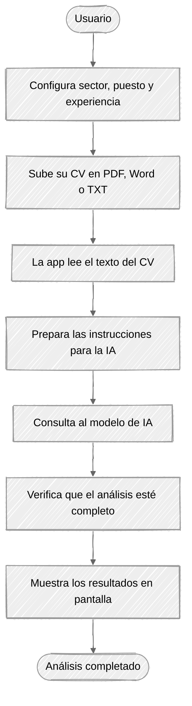
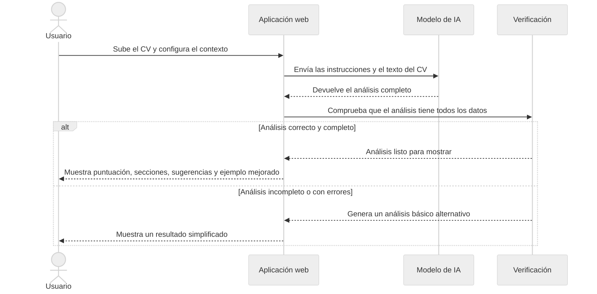

<p align="center">
  
</p>

# 🎯 CV Assistant AI - Reto 9

Asistente de revisión y mejora de CVs basado en IA Generativa.

## 📋 Descripción

Aplicación desarrollada como parte del trabajo práctico de la microcredencial **Artificial Intelligence Foundations** (Fundació URV).

El asistente analiza CVs y proporciona:

- ✅ Puntuación general del CV
- ✅ Análisis detallado por secciones
- ✅ Identificación de fortalezas y debilidades
- ✅ Sugerencias concretas de mejora
- ✅ Versión mejorada de secciones clave

## 🚀 Instalación

### 1. Clonar el repositorio

```bash
git clone https://github.com/jamarcas1984/cv-assistant-ai
cd reto
```

### 2. Crear entorno virtual

```bash
# Windows
python -m venv .venv
.venv\Scripts\activate

# Linux/macOS
python -m venv .venv
source .venv/bin/activate
```

### 3. Instalar dependencias

```bash
pip install -r requirements.txt
```

### 4. Configurar variables de entorno

```bash
# Copiar el archivo de ejemplo
cp .env.example .env

# Editar .env y añadir tu API key de Groq
# Obtén tu API key en: https://console.groq.com
```

## 💻 Uso

### Ejecutar la aplicación localmente

```bash
streamlit run src/app.py
```

La aplicación se abrirá en `http://localhost:8501`

### Uso de la aplicación

1. **Configura el contexto** (sidebar):
   - Sector profesional objetivo
   - Puesto al que aspiras
   - Años de experiencia

2. **Sube tu CV**:
   - Formatos soportados: PDF, TXT, DOCX

3. **Analiza**:
   - Haz clic en "🚀 Analizar CV"
   - Espera unos segundos mientras la IA procesa tu CV

4. **Revisa los resultados**:
   - Puntuación general
   - Análisis por secciones
   - Fortalezas identificadas
   - Áreas de mejora
   - Sugerencias concretas

## 🔄 Diagramas

### Flujo de la aplicación



### Secuencia de llamada al modelo de IA



## 🏗️ Estructura del Proyecto

```
reto/
├── src/
│   ├── app.py                 # Aplicación Streamlit principal
│   ├── llm_integration.py     # Integración con Groq API
│   ├── prompt_templates.py    # Templates de prompts
│   ├── parsers.py             # Parseo de outputs del LLM
│   └── utils.py               # Utilidades (lectura de archivos)
├── requirements.txt           # Dependencias del proyecto
├── .env.example              # Ejemplo de configuración
├── .gitignore                # Archivos ignorados por Git
├── README.md                 # Este archivo
├── doc.pdf                   # Documentación del proyecto
├── slides.pdf                # Presentación del proyecto
├── streamlit.txt             # Enlace a la app desplegada
└── video.txt                 # Enlace al vídeo demostrativo
```

## 🤖 LLM Utilizado

- **Proveedor**: OpenRouter
- **Modelo**: Gemini 3.1 Flash Lite (`gemini-3.1-flash-lite`)
- **Justificación**:
  - Alto rendimiento en análisis de texto estructurado y seguimiento de instrucciones JSON
  - API gratuita a través de OpenRouter (hasta 500 req/día)
  - Compatible con el SDK estándar de OpenAI (mínimo cambio de código)
  - Excelente balance entre velocidad, calidad y coste cero

## 🎓 Técnicas de Prompt Engineering

1. **Role Prompting**: Definición del rol de experto en RRHH
2. **Few-Shot Learning**: Ejemplos de análisis en el prompt
3. **Output Formatting**: Forzar salida en formato JSON estructurado
4. **Chain-of-Thought**: Solicitar razonamiento paso a paso
5. **Temperature Control**: Ajuste de creatividad vs precisión

## 📊 Tecnologías

- **Frontend**: Streamlit
- **LLM**: OpenRouter API (Gemini 3.1 Flash Lite)
- **Procesamiento**: Python 3.12
- **Librerías**: PyPDF2, python-docx, openai, requests

## 👥 Autores

- Javier Martín Castro

## 📅 Fecha

Marzo-Mayo 2026

## 📄 Licencia

Proyecto académico - Fundació URV

---

<p align="center">
  
  <br/>
  <em>Artificial Intelligence Foundations | Fundació Universitat Rovira i Virgili</em>
</p>
